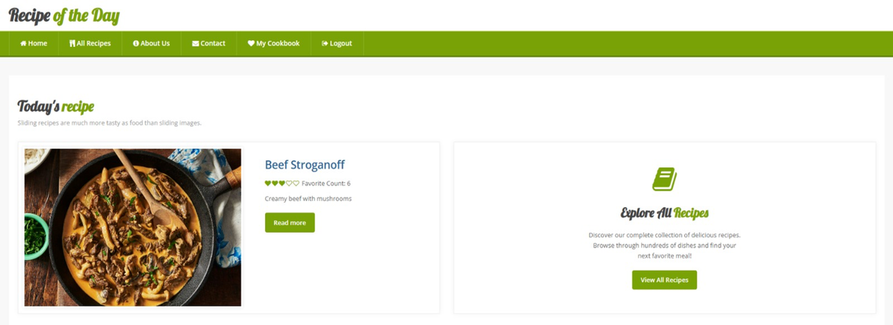
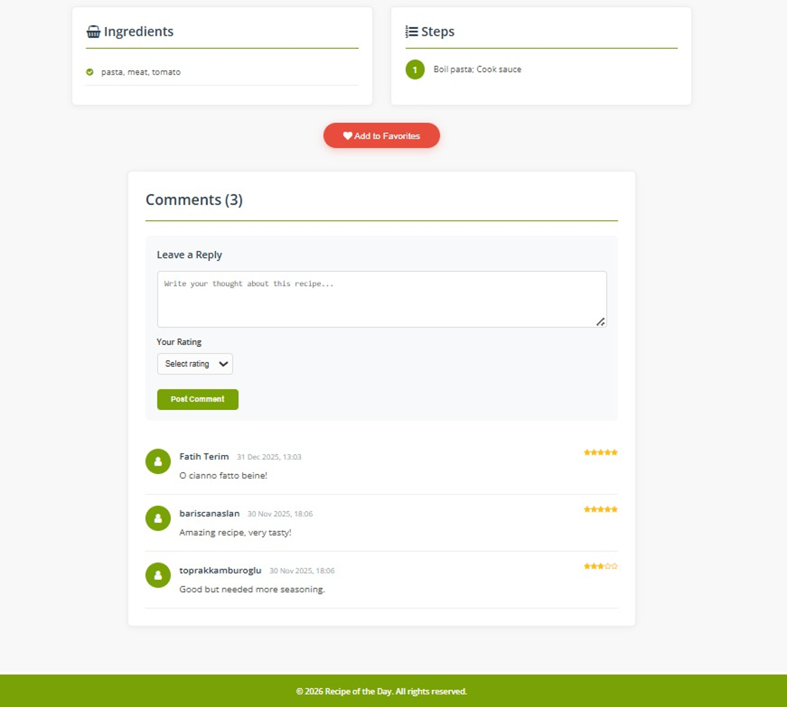
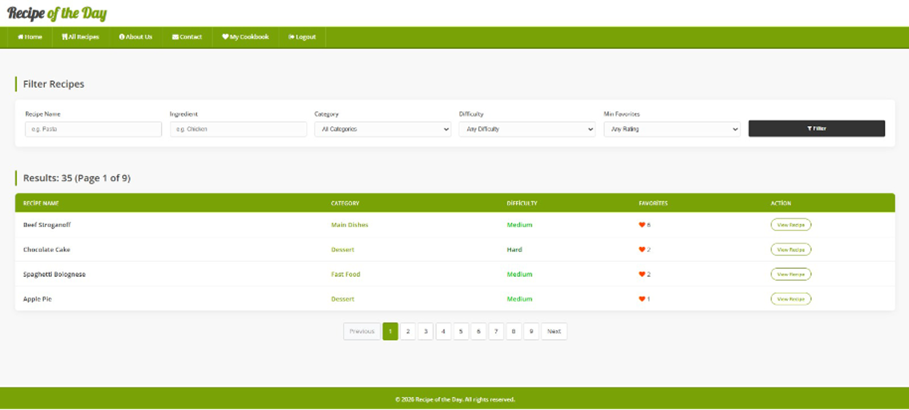
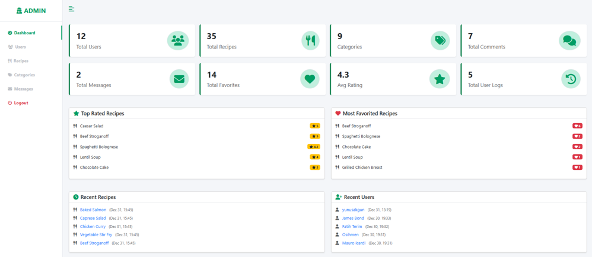
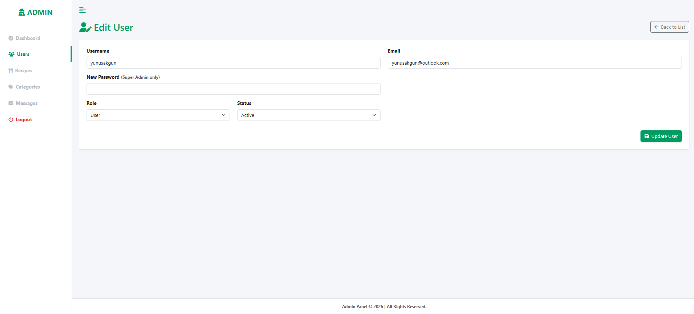

# 🍳 Recipe of the Day

A full-stack web application for discovering, sharing, and managing recipes. Built with PHP, MySQL, and modern web technologies.

## ✨ Features

### User Features
- **Browse Recipes**: Explore a wide collection of recipes with filtering and search
- **Recipe Details**: View ingredients, steps, prep time, and difficulty levels
- **Personal Cookbook**: Save favorite recipes to your personal collection
- **Comments & Ratings**: Leave reviews and rate recipes
- **Advanced Search**: Filter by category, difficulty, ingredients, and favorites

### Admin Features
- **Dashboard**: Overview with statistics and recent activities
- **Recipe Management**: Full CRUD operations for recipes
- **Category Management**: Organize recipes into categories
- **User Management**: Manage user accounts and roles
- **Content Moderation**: Review and manage comments

### Super Admin Features
- **Dashboard**: Overview with statistics and recent activities
- **Recipe Management**: Full CRUD operations for recipes
- **Category Management**: Organize recipes into categories
- **User Management**: Manage user accounts and roles
- **Content Moderation**: Review and manage comments
- **Edit User**: Change users' password

---

## 🛠️ Tech Stack

**Frontend:**
- HTML5, CSS3, Bootstrap 5
- JavaScript (ES6+)
- Font Awesome Icons

**Backend:**
- PHP 8.x
- PDO (MySQL)
- Session Management
- File Upload Handling

**Database:**
- MySQL 8.x
- Relational Database Design
- Foreign Key Constraints

---

## 🗃️ Database Structure

The application uses 6 main tables:

- **users**: User accounts and authentication
- **recipes**: Recipe data (title, ingredients, steps, images)
- **categories**: Recipe categories
- **favorites**: User's saved recipes
- **comments**: User reviews and ratings
- **daily_recipe**: Featured recipe of the day

---

## 🚀 Installation

### Prerequisites
- PHP 8.0 or higher
- MySQL 8.0 or higher
- Apache/Nginx web server
- Composer (optional)

### Steps

1. **Clone the repository**
```bash
git clone https://github.com/yourusername/recipe-of-the-day.git
cd recipe-of-the-day
```

2. **Import Database**
```bash
mysql -u root -p < recipe_of_the_day.sql
```

3. **Configure Database Connection**
Edit `config/database.php`:
```php
define('DB_HOST', 'localhost');
define('DB_NAME', 'recipe_of_the_day');
define('DB_USER', 'root');
define('DB_PASS', '');
```

4. **Set Permissions**
```bash
chmod -R 755 uploads/
chmod -R 755 logs/
```

5. **Start Server**
```bash
php -S localhost:8000 -t public
```

6. **Access Application**
- Frontend: `http://localhost:8000`
- Admin Panel: `http://localhost:8000/admin`

**Default Admin Credentials:**
- Username: `admin`
- Password: `admin123`

---

## 📁 Project Structure
```
recipe_of_the_day/
├── admin/                  # Admin panel
│   ├── categories/        # Category management
│   ├── recipes/           # Recipe management
│   └── users/             # User management
├── config/                # Configuration files
│   ├── database.php       # Database connection
│   └── auth.php           # Authentication functions
├── public/                # Public frontend
│   ├── partials/          # Reusable components (header, footer)
│   └── *.php              # Public pages
├── user/                  # User dashboard
│   └── my_cookbook.php    # Personal recipe collection
├── uploads/               # Uploaded files
│   └── recipes/           # Recipe images
```

---

## 📸 Screenshots

### Homepage


*Browse featured recipes and daily recommendations*

### Recipe Detail Page


*View complete recipe with ingredients, steps, and user reviews*

### Search & Filter

*Advanced filtering by category, difficulty, and ingredients*

### My Cookbook

*Personal collection of favorite recipes*

### Admin Dashboard

*Comprehensive admin panel with statistics and management tools*

### Recipe Management

*Create, edit, and delete recipes with image upload*

### Super Admin

*Edit user password with only difference with admin*

---

## 👥 Team

**CMPE 487 - Web Programming Project**

- **Kamburoğlu, Toprak** - Full Stack Development
- **Course**: CMPE 487 - Web Programming
- **Institution**: [Kadir Has University]
- **Semester**: Spring 2025

---

## 📄 License

This project is developed as part of CMPE 487 course requirements.

## 📞 Contact

For questions or feedback, please reach out:
- Email: your.email@example.com
- GitHub: [@ToprakKamburoglu](https://github.com/ToprakKamburoglu)

